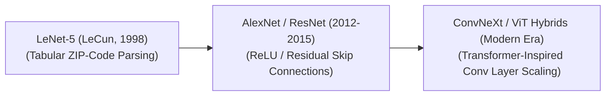

# Awesome-Convolutional-Neural-Networks
## Convolutional Neural Networks (CNNs): Evolution, Variants, Types, & Applications

A Convolutional Neural Network (CNN) is a hardware-aware deep learning architecture explicitly designed to process data structured as multi-dimensional grids, most notably 2D images. CNNs revolutionized computer vision by replacing fully connected layers—which treat every pixel independently and explode in parameter size—with localized mathematical **convolution operations**. By sliding a small matrix of weights (a kernel or filter) across an input canvas, CNNs natively enforce **local connectivity** and **translation invariance**. This allows the network to automatically extract spatial hierarchies, capturing low-level edges and textures in early blocks, and composing them into high-level semantic objects in deeper layers.

---

## 1. The Chronological Evolution

The technical architecture of convolutional processing has transitioned from flat hand-crafted feature maps to deep residual topologies, dense cross-layer connections, and scalable transformer hybrids.

*   **The Foundational Structural Era (LeNet-5, LeCun et al., 1998)**
    *   *Concept:* The core blueprint inspired by Hubel and Wiesel's early biological visual cortex research. It established the standard sequence of interleaving **Convolutional layers**, **Subsampling (Pooling) layers**, and **Fully Connected layers** to execute handwritten digit and ZIP-code parsing.
    *   *Limitation:* Bound heavily by CPU computing constraints, making it mathematically impossible to scale past shallow, low-resolution processing blocks.
*   **The Deep ImageNet Scaling Era (AlexNet to ResNet, 2012–2015)**
    *   *Concept:* Sparked the modern deep learning boom. **AlexNet (2012)** leveraged GPU acceleration and non-linear ReLU activations to scale depth. As models grew deeper, **VGG (2014)** standardized tiny $3 \times 3$ filters, while **ResNet (2015)** introduced **Residual Skip Connections** ($y = f(x) + x$) to solve the vanishing gradient problem.
    *   *Significance:* Unlocked the ability to train ultra-deep architectures exceeding 100+ layers stably, surpassing human-level accuracy on image classification benchmarks.
*   **The Modern Modernization & Transformer-Hybrid Era (~2022–Present)**
    *   *Concept:* Driven by the competitive rise of Vision Transformers (ViTs). Architectures like Meta's **ConvNeXt** modernized classical CNNs by integrating design choices from Transformers (e.g., inverted bottlenecks, patchified data ingestion grids, and larger $7 \times 7$ localized convolutional kernels).
    *   *Significance:* Proved that purely convolutional networks can match or exceed the scaling properties and accuracy of Vision Transformers while retaining the native inductive biases that make CNNs computationally efficient.

---

## 2. Core Functional & Convolutional Variants

The CNN family tree features specialized architectural modifications designed to optimize processing speed, handle variable channel dimensions, or limit parameter scale.

*   **Standard 2D Convolution**
    *   *Mechanism:* Slides a fixed-size 2D spatial window across all input channels simultaneously, aggregating depth and spatial parameters into a unified output tensor.
*   **Dilated / Atrous Convolution**
    *   *Mechanism:* Injects regular mathematical gaps (holes) into the kernel matrix, spacing out the filter weights during spatial sampling steps.
    *   *Pros:* Significantly expands the model's **effective receptive field** without adding a single extra parameter, making it the default block for dense image segmentation and semantic pixel tracking.
*   **Depthwise Separable Convolution (MobileNet Class)**
    *   *Mechanism:* Splices the standard convolution step into two independent operations:
        1.  *Depthwise Convolution:* Applies a single 2D spatial filter per channel independently.
        2.  *Pointwise Convolution:* Applies a $1 \times 1$ window across the channel depth to mix data.
    *   *Pros:* Reduces total floating-point computing operations (FLOPs) and parameter footprints by up to $90\%$, unlocking deep vision capabilities on compact edge microcontrollers.
*   **Deformable Convolution**
    *   *Mechanism:* Adds learnable, 2D continuous coordinate offsets directly to the structural kernel grid points.
    *   *Pros:* Allows the convolution layer's sampling window to adaptively morph its geometric shape to wrap around irregular, non-rigid real-world objects.

---

## 3. High-Capacity Architectural Component Types

To scale CNNs effectively, developers deploy specific infrastructure layers to manage tensor dimensions, control feature ranges, and enforce spatial compression.

*   **Max / Average Pooling Layers**
    *   *Profile:* Executes downstream spatial dimensionality reduction. Max-pooling extracts the absolute peak activation value within a localized grid window, filtering out structural noise while reinforcing spatial translation invariance.
*   **Inverted Bottlenecks & Depth Expansion (EfficientNet Class)**
    *   *Profile:* Structures internal hidden dimensions. It compresses features down into a tight channel neck before exploding capacity outward into wide hidden state arrays, optimizing model throughput.
*   **Squeeze-and-Excitation (SE) Attention Blocks**
    *   *Profile:* A lightweight channel-attention layer. It computes global spatial averages across an image tensor, calculating explicit channel-wise weighting scalars to adaptively amplify important feature pathways while suppressing redundant vectors.

---

## 4. Production Engineering Challenges & Hardware Solutions

Deploying high-throughput computer vision models at scale requires balancing deep network graphs with real-world silicon hardware constraints.

*   **The GPU Memory-Bandwidth Boundary (Activation Bloat)**
    *   *The Problem:* Extremely wide convolutional channels generate massive multi-gigabyte intermediate activation maps during the forward pass. Storing these tensors in High Bandwidth Memory (HBM) for the backward loop creates intense memory bus bottlenecks that stall training speeds.
    *   *Mitigation:* Implementing **Operator Fusion compilers** or utilizing **Selective Activation Checkpointing**, which immediately discards non-boundary activation layers after forward execution and rematerializes them on-the-fly during backpropagation.
*   **The Spatial Resolution Loss Dilemma**
    *   *The Problem:* Repeatedly passing image tensors through stride convolutions and max-pooling layers downsamples spatial canvas grids rapidly. By the time features reach deep layers, fine-grained pixel coordinates are completely blurred, causing the model to fail at precision tasks like reading text typography or pinpointing object borders.
    *   *Mitigation:* transition away from flat sequential processing toward **U-Net architectures (Encoder-Decoder graphs)**, which deploy long-range lateral skip connections to route raw, high-resolution spatial boundaries straight to the final reconstruction layers.

---

## 5. Frontier Real-World AI Applications

*   **Autonomous Vehicle Multimodal Perception Stacks**
    *   *Application:* Ingests continuous, high-frame-rate streaming camera video feeds, radar signatures, and lidar grids concurrently. Deep 2D and 3D CNN backbones execute localized object tracking, road lane segmentation, and real-time obstacle bounding blocks under severe weather glare safely.
*   **High-Resolution Clinical Diagnostic Imaging (MedTech)**
    *   *Application:* Processes massive multi-megapixel medical scans (such as MRIs, CT volumes, X-rays, and digital pathology slides). Fully Convolutional Networks (FCNs) execute automated pixel-level tissue segmentation, helping radiologists identify microscopic tumor boundaries and rare structural fractures with high precision.
*   **Industrial Automated Quality Control & Inspection**
    *   *Application:* Monitors high-speed automated factory assembly lines. Embedded edge CNNs process live visual data from high-resolution micro-cameras, screening circuit boards or mechanical assemblies for micro-defects (such as hairline cracks or missing components) and halting the line instantly if a structural anomaly is identified.

