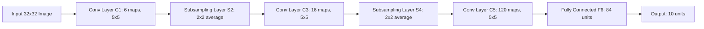

# LeNet-5: The Foundational Structural Era

LeNet-5 is a pioneering convolutional neural network architecture proposed by Yann LeCun, Leon Bottou, Yoshua Bengio, and Patrick Haffner in 1998. It was designed primarily for handwritten character and digit recognition.

## Architectural Architecture & Design
LeNet-5 established the classic paradigm of alternating **convolutional layers**, **subsampling (pooling) layers**, and **fully connected layers**.

### Network Structure

## Key Contributions
- **Local Receptive Fields**: Restricting weight connections to local neighborhoods to capture local spatial features.
- **Shared Weights**: Using the same feature detector kernel across the image to reduce parameter counts and enforce translation invariance.
- **Spatial Subsampling**: Reducing resolution to achieve robustness to minor shifts and distortions.\n